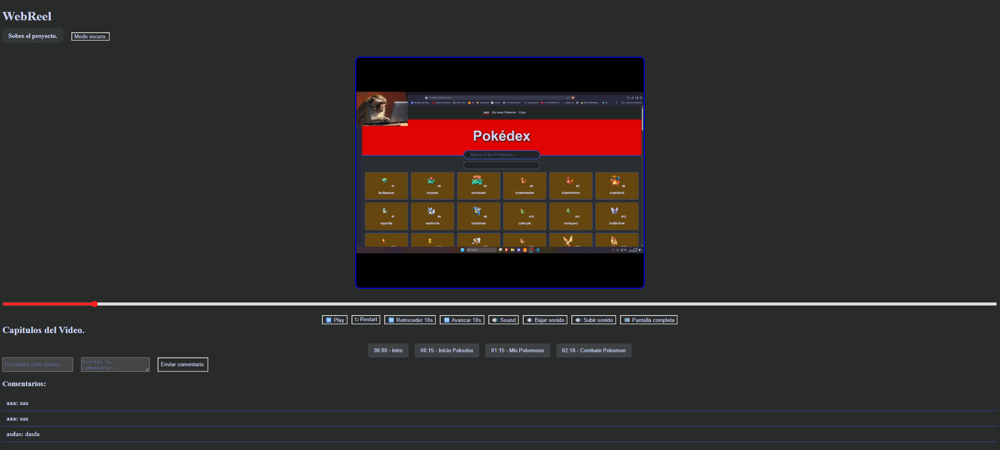

# Pràctica Transversal: **WebReel — El teu vídeo al web**

> **Cicle:** CFGS Desenvolupament d'Aplicacions Web (DAW) **Mòduls implicats:** 0485 Programació · 0612 DWEC · 0615 Disseny d'interfícies web · 0489 Programació multimèdia i dispositius mòbils.

---

# 🎬 WebReel -

Proyecto interactivo de reproducción de vídeo sobre la explicación del proyecto de una pokedex funcional.

**URL de demostración:** [ENLACE A TU GITHUB PAGES AQUÍ]

---

## 📝 Descripción
Esta aplicación es una plataforma "WebReel" que presenta un vídeo explicativo sobre una Pokedex. Incluye un reproductor personalizado, un sistema de comentarios con persistencia y datos meteorológicos en tiempo real.

## 🛠️ Tecnologías utilizadas
*   **HTML5 & CSS3:** Estructura semántica y diseño (Modo Oscuro incluido).
*   **JavaScript (Vanilla):** Lógica del reproductor, manipulación del DOM y gestión de APIs.
*   **OpenWeatherMap API:** Consumo de datos meteorológicos mediante `fetch`.
*   **Web Storage:** Uso de `localStorage` y `sessionStorage`.

## 🚀 Instrucciones de arrencada (Instalación)
No requiere instalación de aplicaciones externas:
1. Clona el repositorio: `git clone https://github.com/tu-usuario/nombre-repo.git`
2. Abre el archivo `index.html` en cualquier navegador moderno.
3. *Nota:* Se recomienda usar la extensión "Live Server" en VS Code para una mejor experiencia con las APIs.

## 📊 Informe de Accesibilidad y Usabilidad
*   **Accesibilidad:** 
    *   Uso de etiquetas semánticas (`<header>`, `<main>`, `<aside>`, `<section>`).
    *   Contraste optimizado para lectura en Modo Oscuro y Claro.
    *   Atributos `alt` en imágenes generadas por la API.
*   **Usabilidad:** 
    *   Controles de vídeo intuitivos y accesibles.
    *   Navegación clara entre la página principal y "Sobre el proyecto".
    *   Validación de formularios en tiempo real para evitar errores del usuario.

## 📸 Capturas de Pantalla

## ⚖️ Licencia
Este proyecto es de uso educativo y se distribuye bajo la licencia **©️**.

## 👤 Autor
*   **Francisco Fernández** - 1º DAW (2026)
*   Todos los recursos multimedia han sido utilizados con fines didácticos.